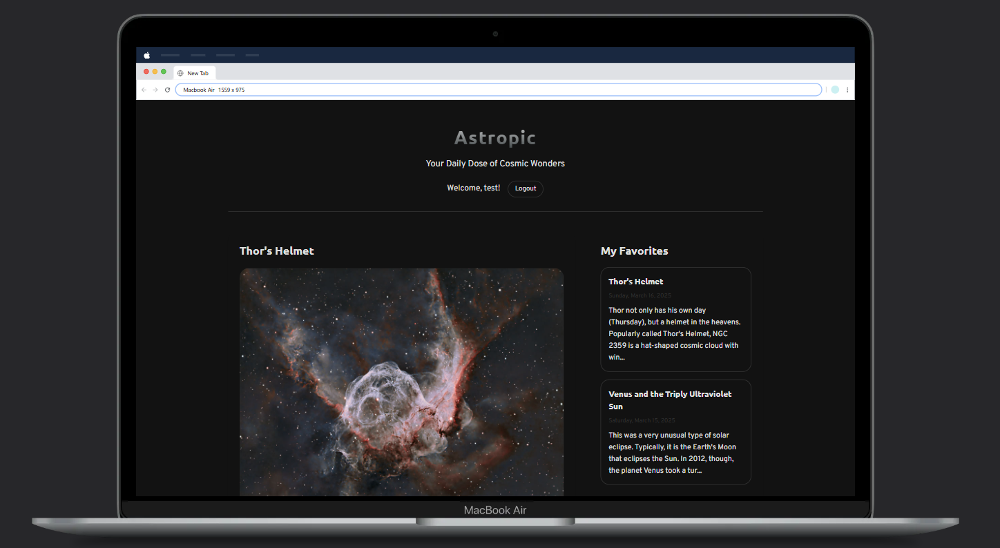
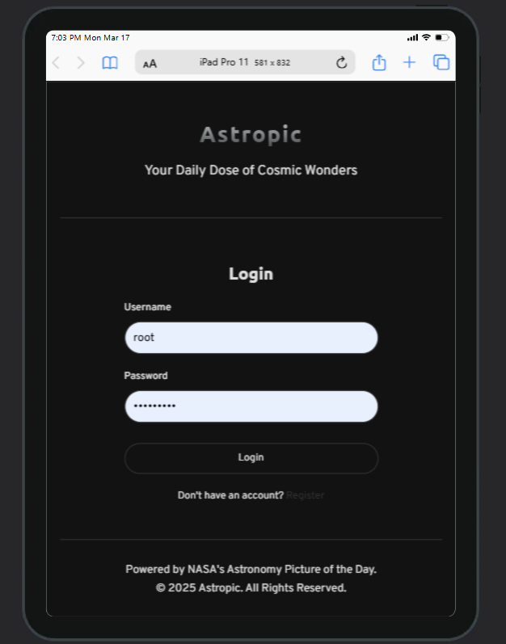
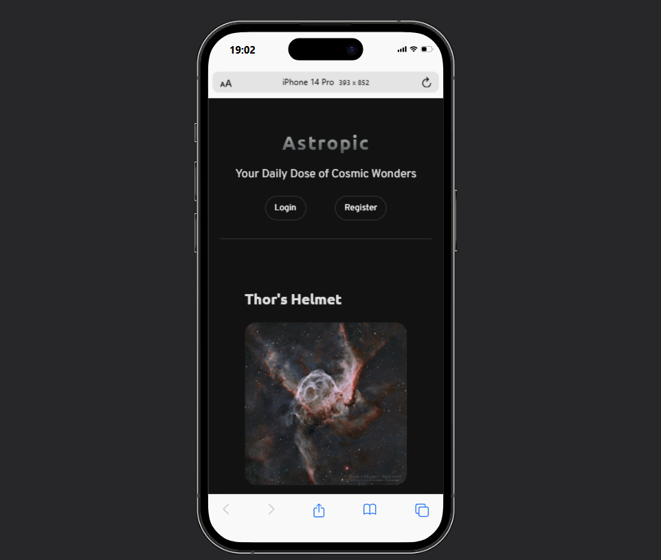

# WD-PRAC-7
Astropic is a web application that displays NASA's Astronomy Picture of the Day (APOD) and allows registered users to save their favorites. The application features a responsive design, user authentication system, and API integration with NASA's APOD service.

## Structure
- Frontend: HTML, CSS, and JavaScript
- Backend: PHP with MySQL database
- API Integration: NASA's APOD API

### Database structure
1. Users table:
```sql
CREATE TABLE users (
    id INT(11) AUTO_INCREMENT PRIMARY KEY,
    username VARCHAR(50) NOT NULL UNIQUE,
    password VARCHAR(255) NOT NULL,
    email VARCHAR(100) NOT NULL UNIQUE,
    created_at TIMESTAMP DEFAULT CURRENT_TIMESTAMP
)
```

2. Favorites table:
```sql
CREATE TABLE favorites (
    id INT(11) AUTO_INCREMENT PRIMARY KEY,
    user_id INT(11) NOT NULL,
    title VARCHAR(255) NOT NULL,
    date DATE NOT NULL,
    explanation TEXT NOT NULL,
    url VARCHAR(255) NOT NULL,
    media_type VARCHAR(50) NOT NULL,
    created_at TIMESTAMP DEFAULT CURRENT_TIMESTAMP,
    FOREIGN KEY (user_id) REFERENCES users(id) ON DELETE CASCADE
)
```

## Frontend
The main page <span style="color: blue;">index.html</span> displays:
- NASA's Astronomy Picture of the Day
- Authentication controls (login/register or user info with logout)
- User's saved favorites (when logged in)

The page <span style="color: blue;">login.html</span> contains a form for user authentication with:
- Username input
- Password input
- Form validation
- Link to registration page

The page <span style="color: blue;">register.html</span> contains a register form for new users with:
- Username input
- Email input
- Password and confirmation inputs
- Form validation
- Link to login page

### JavaScript (<span style="color: blue;">script.js</span>)

The script handles all client-side functionality in different parts:

1. Authentication:
- <span style="color: yellow;">checkAuthStatus()</span>: Verifies if user is logged in.

- <span style="color: yellow;">updateAuthUI()</span>: Updates UI elements based on login status.

- <span style="color: yellow;">logout()</span>: Handles user logout.

2. APOD Funcionality:
- <span style="color: yellow;">fetchAPOD()</span>: Retrieves the astronomy picture from NASA API.

- <span style="color: yellow;">displayAPOD()</span>: Renders the APOD and its details.

- <span style="color: yellow;">showLoader(), hideLoader(), showError()</span>: Manage loading states.

3. Favorites Management:
- <span style="color: yellow;">addToFavorites</span>: Saves current APOD to user favorites.

- <span style="color: yellow;">loadFavorites()</span>: Retrieves user's saved favorites.

- <span style="color: yellow;">displayFavorites()</span>: Renders the favorites list.

### Styling (<span style="color: blue;">styles.css</span>)

Provides responsive design with:

- Dark theme optimized for astronomy content
- Custom fonts (Overpass and Ubuntu).
- Responsive layout using CSS Grid and Flexbox.
- Form styling and validation feedback.
- Loading animations and state handling.

## Backend
### Configuration (<span style="color: blue;">config.php</span>)
- Database connection setup.
- Database creation (if tables don't exist).
- Error handling for database operations.

### Authentication <span style="color: blue;">(auth.php, login.php, register.php)</span>

- Session management.
- User registration with validation:
    - Required fields
    - Email format
    - Password length
    - Username/email uniqueness
- Secure password handling using PHP's <span style="color: yellow;"> password_hash()</span> and <span style="color: yellow;"> password_verify()</span>. 
- Login functionality
- Authentication status checking
- Logout functionality

### Main Application API (<span style="color: blue;">main.php</span>)

Handles core application functionality:

- Adding favorites to the database.
- Retrieving user's favorites.
- JSON response formatting.
- Input validation and error handling.


### NASA APOD API
- Endpoint: https://api.nasa.gov/planetary/apod
- Authentication: API key (stored in JavaScript constant).
- Response handling for both image and video content types.
- Error handling for failed API requests.

## Images of the website 
- Big screen:


- Tablets:


- Phones:


## Link to GitHub
[GitHub Repository](https://github.com/faiyamm/WD-PRAC-7)